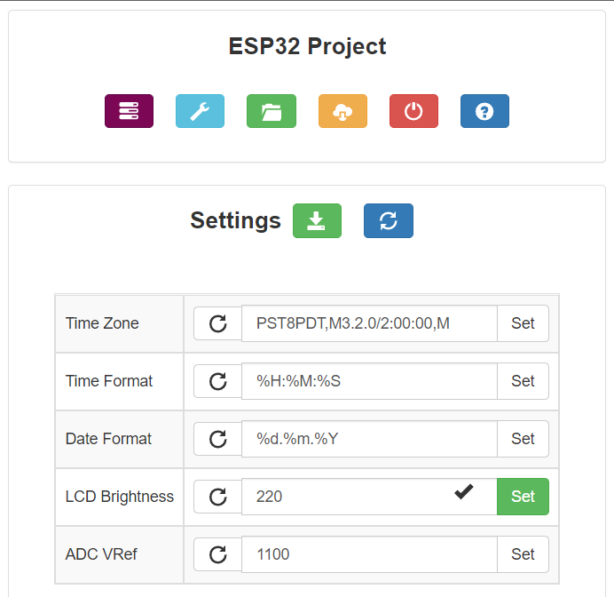

<!-- PROJECT LOGO -->
 

  

<h3 align="center">Very Useful ESP Framework</h3>

  

    ESP32 configuration, state pub/sub WebUI OTA framework.
  

<!-- ABOUT THE PROJECT -->
## About The Project

### Project State
This is still a work in progress. 

### Features

* OTA

## Configuration

## TODO

* Documentation
* Access Point
* Wizard
* License

## Links

## Credits
Web UI is inspired by and somewhat based on [ESP3D-WEBUI](https://github.com/luc-github/ESP3D-WEBUI) and [FluidNC](https://github.com/bdring/FluidNC)

## Screenshots

(<a href="#top">back to top</a>)
 
